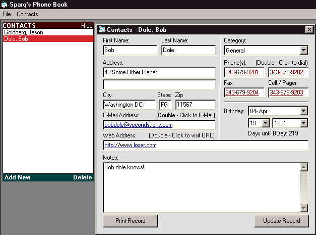



## Personal Phone Book v1\.0

### Description

Keep track of your contacts! Dial their phone number(s)! Write them an E-Mail or visit their website with the click of a button. Please vote!
 
### More Info
 

             |
---                |---
**Submitted On**   |2000-09-12 12:04:12
**By**             |[Sparq](https://github.com/Planet-Source-Code/PSCIndex/blob/master/ByAuthor/sparq.md)
**Level**          |Intermediate
**User Rating**    |4.2 (21 globes from 5 users)
**Compatibility**  |VB 6\.0
**Category**       |[Complete Applications](https://github.com/Planet-Source-Code/PSCIndex/blob/master/ByCategory/complete-applications__1-27.md)
**World**          |[Visual Basic](https://github.com/Planet-Source-Code/PSCIndex/blob/master/ByWorld/visual-basic.md)
**Archive File**   |[CODE\_UPLOAD98389122000\.zip](https://github.com/Planet-Source-Code/sparq-personal-phone-book-v1-0__1-11423/archive/master.zip)

